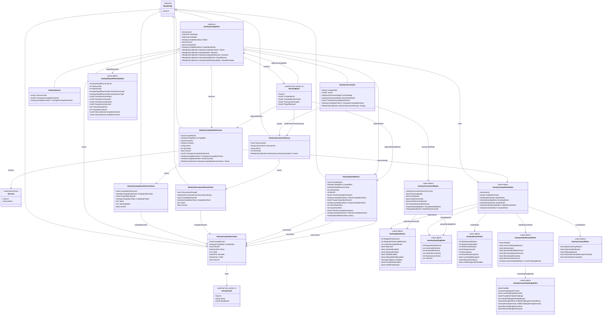

# Hockey domain — Competitions / Season / Tournament / Division / Playoff / Rules

```mermaid
classDiagram
    direction TB

    class BaseEntity {
        <<abstract>>
        +Guid Id
    }

    class HockeyTeam {
        <<external from section 2>>
        +Guid Id
        +string Name
        +string ShortName
    }

    class HockeyMatch {
        <<external from section 3>>
        +Guid Id
        +Guid? CompetitionId
        +Guid? CompetitionDivisionId
        +Guid? TournamentGroupId
        +Guid? PlayoffSeriesId
    }

    class Division {
        <<external/common>>
        +Guid Id
        +string Name
    }

    class HockeyCompetition {
        <<abstract>>
        +string Name
        +DateTime StartDate
        +DateTime EndDate
        +HockeyCompetitionStatus Status
        +bool IsActive
        +bool IsCompleted
        +HockeyCompetitionRules CompetitionRules
        +IReadOnlyCollection~HockeyCompetitionTeam~ Teams
        +IReadOnlyCollection~HockeyMatch~ Matches
        +IReadOnlyCollection~HockeyCompetitionDivision~ Divisions
        +IReadOnlyCollection~HockeyPlayoffSeries~ PlayoffSeries
        +IReadOnlyCollection~HockeyPlayoffScheduleSlot~ PlayoffSchedule
    }

    class HockeySeason {
        +string? SeasonCode
        +Guid? ChampionCompetitionTeamId
        +HockeyCompetitionTeam? ChampionCompetitionTeam
    }

    class HockeyTournament {
        +string? ContentHtml
        +string? Venue
        +HockeyTournamentStage CurrentStage
        +HockeyTournamentRules TournamentRules
        +Guid? ChampionCompetitionTeamId
        +HockeyCompetitionTeam? ChampionCompetitionTeam
        +IReadOnlyCollection~HockeyTournamentGroup~ Groups
    }

    class HockeyCompetitionTeam {
        +Guid CompetitionId
        +HockeyCompetition Competition
        +Guid TeamId
        +HockeyTeam Team
        +int? Seed
        +DateTime JoinedAt
        +DateTime? LeftAt
        +bool IsActive
    }

    class HockeyCompetitionDivision {
        +Guid CompetitionId
        +HockeyCompetition Competition
        +Guid DivisionId
        +Division Division
        +string Name
        +int SortOrder
        +bool IsActive
        +Guid? ChampionCompetitionTeamId
        +HockeyCompetitionTeam? ChampionCompetitionTeam
        +HockeyCompetitionRules? RulesOverride
        +IReadOnlyCollection~HockeyCompetitionDivisionTeam~ Teams
    }

    class HockeyCompetitionDivisionTeam {
        +Guid CompetitionDivisionId
        +HockeyCompetitionDivision CompetitionDivision
        +Guid CompetitionTeamId
        +HockeyCompetitionTeam CompetitionTeam
        +int? Seed
        +int? StandingRank
        +bool IsActive
    }

    class HockeyTournamentGroup {
        +Guid TournamentId
        +HockeyTournament Tournament
        +string Name
        +int SortOrder
        +IReadOnlyCollection~HockeyTournamentGroupTeam~ Teams
    }

    class HockeyTournamentGroupTeam {
        +Guid TournamentGroupId
        +HockeyTournamentGroup TournamentGroup
        +Guid CompetitionTeamId
        +HockeyCompetitionTeam CompetitionTeam
        +int? Seed
        +bool IsActive
    }

    class HockeyPlayoffSeries {
        +Guid CompetitionId
        +HockeyCompetition Competition
        +HockeyPlayoffRound Round
        +int SeriesOrder
        +int BestOf
        +Guid? HomeCompetitionTeamId
        +HockeyCompetitionTeam? HomeCompetitionTeam
        +Guid? AwayCompetitionTeamId
        +HockeyCompetitionTeam? AwayCompetitionTeam
        +int HomeTeamWins
        +int AwayTeamWins
        +Guid? WinnerCompetitionTeamId
        +HockeyCompetitionTeam? WinnerCompetitionTeam
        +HockeyPlayoffSeriesStatus Status
    }

    class HockeyPlayoffScheduleSlot {
        <<value object>>
        +HockeyPlayoffRound Round
        +int SeriesOrder
        +int MatchOrder
        +HockeyPlayoffSourceType HomeSourceType
        +HockeyPlayoffSourceType AwaySourceType
        +Guid? HomeSourceGroupId
        +Guid? AwaySourceGroupId
        +Guid? HomeSourceSeriesId
        +Guid? AwaySourceSeriesId
        +int? HomeSourceRank
        +int? AwaySourceRank
        +Guid? ManualHomeCompetitionTeamId
        +Guid? ManualAwayCompetitionTeamId
    }

    class HockeyCompetitionRules {
        <<value object>>
        +string Name
        +string? RuleBookVersion
        +HockeyMatchRules MatchRules
        +HockeyStandingRules StandingRules
        +HockeyRosterRules RosterRules
        +HockeyVideoReviewRules? VideoReviewRules
        +HockeyContactRules? ContactRules
    }

    class HockeyMatchRules {
        <<value object>>
        +int RegularPeriodCount
        +int RegularPeriodLengthMinutes
        +int OvertimeLengthMinutes
        +bool StopClock
        +bool OvertimeEnabled
        +bool ShootoutEnabled
        +bool OffsideEnabled
        +bool DelayedOffsideEnabled
        +HockeyIcingRule IcingRule
        +bool PenaltyShotEnabled
        +bool GoaliePullAllowed
    }

    class HockeyStandingRules {
        <<value object>>
        +int RegulationWinPoints
        +int OvertimeWinPoints
        +int ShootoutWinPoints
        +int OvertimeLossPoints
        +int ShootoutLossPoints
        +int TiePoints
    }

    class HockeyRosterRules {
        <<value object>>
        +int MaxDressedPlayers
        +int MaxDressedGoalies
        +int MinDressedPlayers
        +bool RequiresGoalie
        +int MaxCaptains
        +int MaxAlternateCaptains
        +bool CanGoalieBeCaptain
        +bool AllowGuestPlayers
        +bool LineManagementEnabled
    }

    class HockeyVideoReviewRules {
        <<value object>>
        +bool Enabled
        +bool CoachChallengeAllowed
        +bool ReviewGoals
        +bool ReviewOffsideBeforeGoal
        +bool ReviewGoalieInterference
        +bool ReviewHighStickGoal
        +bool ReviewPuckOverLine
        +HockeyCoachChallengeRules? CoachChallengeRules
    }

    class HockeyCoachChallengeRules {
        <<value object>>
        +bool Enabled
        +int MaxChallengesPerTeam
        +bool LoseChallengeAfterFailed
        +bool PenaltyForFailedChallenge
        +int FailedChallengePenaltyMinutes
        +HockeyPenaltyOffence FailedChallengePenaltyOffence
        +HockeyPenaltySeverity FailedChallengePenaltySeverity
        +bool AllowChallengeInOvertime
        +bool AllowChallengeInShootout
    }

    class HockeyContactRules {
        <<value object>>
        +bool BodyCheckingAllowed
        +bool OpenIceHitsAllowed
        +bool FightingAllowed
        +bool AutomaticGameMisconductForFight
        +bool StrictHeadContactRule
    }

    class HockeyTournamentRules {
        <<value object>>
        +HockeyTournamentFormat Format
        +bool HasGroupStage
        +bool HasPlayoffs
        +bool HasBronzeGame
        +bool HasPlacementGames
        +int TeamsAdvancingPerGroup
        +HockeyStandingRules? GroupStandingRules
        +HockeyMatchRules? MatchRulesOverride
    }

    BaseEntity <|-- HockeyCompetition
    HockeyCompetition <|-- HockeySeason
    HockeyCompetition <|-- HockeyTournament
    BaseEntity <|-- HockeyCompetitionTeam
    BaseEntity <|-- HockeyCompetitionDivision
    BaseEntity <|-- HockeyCompetitionDivisionTeam
    BaseEntity <|-- HockeyTournamentGroup
    BaseEntity <|-- HockeyTournamentGroupTeam
    BaseEntity <|-- HockeyPlayoffSeries

    HockeyCompetition "1" --> "*" HockeyCompetitionTeam : teams
    HockeyCompetitionTeam --> HockeyTeam : team

    HockeyCompetition "1" --> "*" HockeyMatch : matches
    HockeyMatch --> HockeyCompetition : optionalCompetition

    HockeyCompetition "1" --> "*" HockeyCompetitionDivision : divisions
    HockeyCompetitionDivision --> Division : division
    HockeyCompetitionDivision "1" --> "*" HockeyCompetitionDivisionTeam : teams
    HockeyCompetitionDivisionTeam --> HockeyCompetitionTeam : competitionTeam

    HockeyTournament "1" --> "*" HockeyTournamentGroup : groups
    HockeyTournamentGroup "1" --> "*" HockeyTournamentGroupTeam : teams
    HockeyTournamentGroupTeam --> HockeyCompetitionTeam : competitionTeam

    HockeyCompetition "1" --> "*" HockeyPlayoffSeries : playoffSeries
    HockeyCompetition "1" --> "*" HockeyPlayoffScheduleSlot : playoffSchedule

    HockeyPlayoffSeries --> HockeyCompetitionTeam : homeTeam
    HockeyPlayoffSeries --> HockeyCompetitionTeam : awayTeam
    HockeyPlayoffSeries --> HockeyCompetitionTeam : winnerTeam

    HockeyMatch --> HockeyCompetitionDivision : optionalDivision
    HockeyMatch --> HockeyTournamentGroup : optionalTournamentGroup
    HockeyMatch --> HockeyPlayoffSeries : optionalPlayoffSeries

    HockeyCompetition --> HockeyCompetitionRules : rules
    HockeyCompetitionDivision --> HockeyCompetitionRules : rulesOverride
    HockeyTournament --> HockeyTournamentRules : tournamentRules

    HockeyCompetitionRules --> HockeyMatchRules : matchRules
    HockeyCompetitionRules --> HockeyStandingRules : standingRules
    HockeyCompetitionRules --> HockeyRosterRules : rosterRules
    HockeyCompetitionRules --> HockeyVideoReviewRules : videoReviewRules
    HockeyCompetitionRules --> HockeyContactRules : contactRules
    HockeyVideoReviewRules --> HockeyCoachChallengeRules : coachChallengeRules

    HockeyTournamentRules --> HockeyStandingRules : groupStandingRules
    HockeyTournamentRules --> HockeyMatchRules : matchRulesOverride
```
