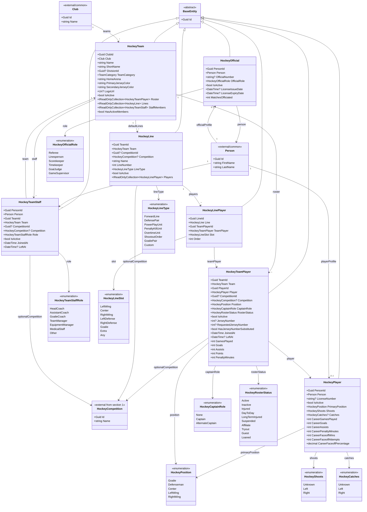

# Hockey domain — Teams / Players / Roster / Lines / Staff / Officials

```mermaid
classDiagram
    direction TB

    class BaseEntity {
        <<abstract>>
        +Guid Id
    }

    class Person {
        <<external/common>>
        +Guid Id
        +string FirstName
        +string LastName
    }

    class Club {
        <<external/common>>
        +Guid Id
        +string Name
    }

    class HockeyCompetition {
        <<external from section 1>>
        +Guid Id
        +string Name
    }

    class HockeyTeam {
        +Guid ClubId
        +Club Club
        +string Name
        +string ShortName
        +Guid? DivisionId
        +TeamCategory TeamCategory
        +string HomeArena
        +string PrimaryJerseyColor
        +string SecondaryJerseyColor
        +Uri? LogoUrl
        +bool IsActive
        +IReadOnlyCollection~HockeyTeamPlayer~ Roster
        +IReadOnlyCollection~HockeyLine~ Lines
        +IReadOnlyCollection~HockeyTeamStaff~ StaffMembers
        +bool HasActiveMembers
    }

    class HockeyPlayer {
        +Guid PersonId
        +Person Person
        +string? LicenseNumber
        +bool IsActive
        +HockeyPosition PrimaryPosition
        +HockeyShoots Shoots
        +HockeyCatches? Catches
        +int CareerGamesPlayed
        +int CareerGoals
        +int CareerAssists
        +int CareerPenaltyMinutes
        +int CareerFaceoffWins
        +int CareerFaceoffAttempts
        +decimal CareerFaceoffPercentage
    }

    class HockeyTeamPlayer {
        +Guid TeamId
        +HockeyTeam Team
        +Guid PlayerId
        +HockeyPlayer Player
        +Guid? CompetitionId
        +HockeyCompetition? Competition
        +HockeyPosition Position
        +HockeyCaptainRole CaptainRole
        +HockeyRosterStatus RosterStatus
        +bool IsActive
        +int? JerseyNumber
        +int? RequestedJerseyNumber
        +bool HasJerseyNumberSubstituted
        +DateTime JoinedAt
        +DateTime? LeftAt
        +int GamesPlayed
        +int Goals
        +int Assists
        +int Points
        +int PenaltyMinutes
    }

    class HockeyLine {
        +Guid TeamId
        +HockeyTeam Team
        +Guid? CompetitionId
        +HockeyCompetition? Competition
        +string Name
        +int LineNumber
        +HockeyLineType LineType
        +bool IsActive
        +IReadOnlyCollection~HockeyLinePlayer~ Players
    }

    class HockeyLinePlayer {
        +Guid LineId
        +HockeyLine Line
        +Guid TeamPlayerId
        +HockeyTeamPlayer TeamPlayer
        +HockeyLineSlot Slot
        +int Order
    }

    class HockeyTeamStaff {
        +Guid PersonId
        +Person Person
        +Guid TeamId
        +HockeyTeam Team
        +Guid? CompetitionId
        +HockeyCompetition? Competition
        +HockeyTeamStaffRole Role
        +bool IsActive
        +DateTime JoinedAt
        +DateTime? LeftAt
    }

    class HockeyOfficial {
        +Guid PersonId
        +Person Person
        +string? OfficialNumber
        +HockeyOfficialRole OfficialRole
        +bool IsActive
        +DateTime? LicenseIssueDate
        +DateTime? LicenseExpiryDate
        +int MatchesOfficiated
    }

    class HockeyPosition {
        <<enumeration>>
        Goalie
        Defenseman
        Center
        LeftWing
        RightWing
    }

    class HockeyShoots {
        <<enumeration>>
        Unknown
        Left
        Right
    }

    class HockeyCatches {
        <<enumeration>>
        Unknown
        Left
        Right
    }

    class HockeyCaptainRole {
        <<enumeration>>
        None
        Captain
        AlternateCaptain
    }

    class HockeyRosterStatus {
        <<enumeration>>
        Active
        Inactive
        Injured
        DayToDay
        LongTermInjured
        Suspended
        Affiliate
        Tryout
        Guest
        Loaned
    }

    class HockeyOfficialRole {
        <<enumeration>>
        Referee
        Linesperson
        Scorekeeper
        Timekeeper
        GoalJudge
        GameSupervisor
    }

    class HockeyTeamStaffRole {
        <<enumeration>>
        HeadCoach
        AssistantCoach
        GoalieCoach
        TeamManager
        EquipmentManager
        MedicalStaff
        Other
    }

    class HockeyLineType {
        <<enumeration>>
        ForwardLine
        DefensePair
        PowerPlayUnit
        PenaltyKillUnit
        OvertimeUnit
        ShootoutOrder
        GoaliePair
        Custom
    }

    class HockeyLineSlot {
        <<enumeration>>
        LeftWing
        Center
        RightWing
        LeftDefense
        RightDefense
        Goalie
        Extra
        Any
    }

    BaseEntity <|-- HockeyTeam
    BaseEntity <|-- HockeyPlayer
    BaseEntity <|-- HockeyTeamPlayer
    BaseEntity <|-- HockeyLine
    BaseEntity <|-- HockeyLinePlayer
    BaseEntity <|-- HockeyTeamStaff
    BaseEntity <|-- HockeyOfficial

    Club "1" --> "*" HockeyTeam : teams

    Person "1" --> "0..1" HockeyPlayer : playerProfile
    Person "1" --> "*" HockeyTeamStaff : staffRoles
    Person "1" --> "0..1" HockeyOfficial : officialProfile

    HockeyTeam "1" --> "*" HockeyTeamPlayer : roster
    HockeyTeam "1" --> "*" HockeyLine : defaultLines
    HockeyTeam "1" --> "*" HockeyTeamStaff : staff

    HockeyTeamPlayer --> HockeyPlayer : player
    HockeyTeamPlayer --> HockeyCompetition : optionalCompetition

    HockeyLine "1" --> "*" HockeyLinePlayer : players
    HockeyLinePlayer --> HockeyTeamPlayer : teamPlayer
    HockeyLine --> HockeyCompetition : optionalCompetition

    HockeyTeamStaff --> HockeyTeam : team
    HockeyTeamStaff --> HockeyCompetition : optionalCompetition

    HockeyOfficial --> Person : person

    HockeyPlayer --> HockeyPosition : primaryPosition
    HockeyPlayer --> HockeyShoots : shoots
    HockeyPlayer --> HockeyCatches : catches

    HockeyTeamPlayer --> HockeyPosition : position
    HockeyTeamPlayer --> HockeyCaptainRole : captainRole
    HockeyTeamPlayer --> HockeyRosterStatus : rosterStatus

    HockeyLine --> HockeyLineType : lineType
    HockeyLinePlayer --> HockeyLineSlot : slot

    HockeyOfficial --> HockeyOfficialRole : role
    HockeyTeamStaff --> HockeyTeamStaffRole : role
```
