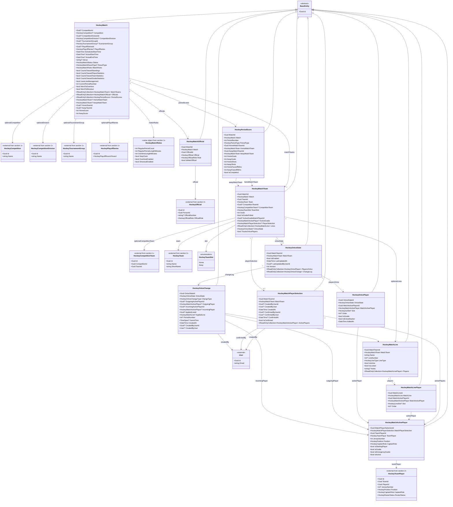
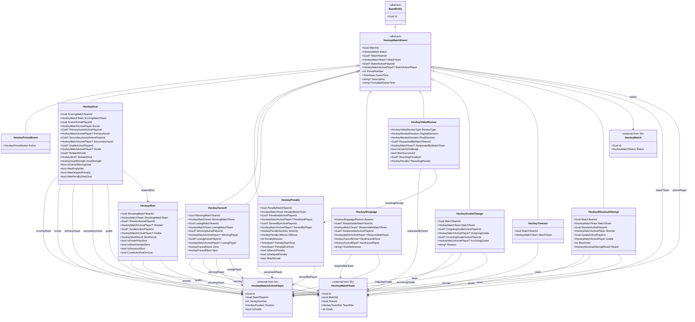

# Hockey domain — Matches (3A: Structure / 3B: Events)

## 3A. Match Structure / Home-Away / Roster / Lines / On-Ice

```mermaid
classDiagram
    direction TB

    class BaseEntity {
        <<abstract>>
        +Guid Id
    }

    class User {
        <<external>>
        +Guid Id
        +string Email
    }

    class HockeyCompetition {
        <<external from section 1>>
        +Guid Id
        +string Name
    }

    class HockeyCompetitionTeam {
        <<external from section 1>>
        +Guid Id
        +Guid CompetitionId
        +Guid TeamId
    }

    class HockeyCompetitionDivision {
        <<external from section 1>>
        +Guid Id
        +string Name
    }

    class HockeyTournamentGroup {
        <<external from section 1>>
        +Guid Id
        +string Name
    }

    class HockeyPlayoffSeries {
        <<external from section 1>>
        +Guid Id
        +HockeyPlayoffRound Round
    }

    class HockeyTeam {
        <<external from section 2>>
        +Guid Id
        +string Name
        +string ShortName
    }

    class HockeyTeamPlayer {
        <<external from section 2>>
        +Guid Id
        +Guid TeamId
        +Guid PlayerId
        +int? JerseyNumber
        +HockeyPosition Position
        +HockeyCaptainRole CaptainRole
        +HockeyRosterStatus RosterStatus
    }

    class HockeyOfficial {
        <<external from section 2>>
        +Guid Id
        +Guid PersonId
        +string? OfficialNumber
        +HockeyOfficialRole OfficialRole
    }

    class HockeyMatchRules {
        <<value object from section 1>>
        +int RegularPeriodCount
        +int RegularPeriodLengthMinutes
        +int OvertimeLengthMinutes
        +bool StopClock
        +bool OvertimeEnabled
        +bool ShootoutEnabled
    }

    class HockeyMatch {
        +Guid? CompetitionId
        +HockeyCompetition? Competition
        +Guid? CompetitionDivisionId
        +HockeyCompetitionDivision? CompetitionDivision
        +Guid? TournamentGroupId
        +HockeyTournamentGroup? TournamentGroup
        +Guid? PlayoffSeriesId
        +HockeyPlayoffSeries? PlayoffSeries

        +DateTime ScheduledStartTime
        +DateTime? ActualStartTime
        +DateTime? ActualEndTime
        +string? Venue
        +HockeyMatchStatus Status
        +HockeyMatchResultType? ResultType
        +HockeyMatchRules MatchRules

        +bool CountsTowardStandings
        +bool CountsTowardPlayerStatistics
        +bool CountsTowardTeamStatistics
        +bool CountsTowardGoalieStatistics
        +bool UsesLineManagement

        +int CurrentPeriodNumber
        +bool WentToOvertime
        +bool WentToShootout

        +IReadOnlyCollection~HockeyMatchTeam~ MatchTeams
        +IReadOnlyCollection~HockeyMatchOfficial~ Officials
        +IReadOnlyCollection~HockeyPeriodScore~ PeriodScores

        +HockeyMatchTeam? HomeMatchTeam
        +HockeyMatchTeam? AwayMatchTeam
        +Guid? HomeTeamId
        +Guid? AwayTeamId
        +int HomeScore
        +int AwayScore
    }

    class HockeyMatchTeam {
        +Guid MatchId
        +HockeyMatch Match
        +Guid TeamId
        +HockeyTeam Team
        +Guid? CompetitionTeamId
        +HockeyCompetitionTeam? CompetitionTeam
        +HockeyTeamSlot TeamSlot

        +int Goals
        +bool IsGoaliePulled
        +Guid? ActiveGoalieMatchPlayerId
        +HockeyMatchActivePlayer? ActiveGoalie

        +HockeyMatchPlayerSelection? PlayerSelection
        +IReadOnlyCollection~HockeyMatchLine~ Lines
        +HockeyOnIceState? OnIceState
        +bool TracksOnIcePlayers
    }

    class HockeyTeamSlot {
        <<enumeration>>
        Home
        Away
    }

    class HockeyMatchPlayerSelection {
        +Guid MatchTeamId
        +HockeyMatchTeam MatchTeam
        +Guid? CreatedByUserId
        +User? CreatedByUser
        +DateTime CreatedAt
        +Guid? ConfirmedByUserId
        +User? ConfirmedByUser
        +DateTime? ConfirmedAt
        +bool IsConfirmed
        +IReadOnlyCollection~HockeyMatchActivePlayer~ ActivePlayers
    }

    class HockeyMatchActivePlayer {
        +Guid MatchPlayerSelectionId
        +HockeyMatchPlayerSelection MatchPlayerSelection
        +Guid TeamPlayerId
        +HockeyTeamPlayer TeamPlayer
        +int JerseyNumber
        +HockeyPosition Position
        +HockeyCaptainRole CaptainRole
        +bool IsStartingPlayer
        +bool IsGoalie
        +bool IsEmergencyGoalie
        +bool IsActive
    }

    class HockeyMatchLine {
        +Guid MatchTeamId
        +HockeyMatchTeam MatchTeam
        +string Name
        +int? LineNumber
        +HockeyLineType LineType
        +bool IsActive
        +bool IsLocked
        +string? Notes
        +IReadOnlyCollection~HockeyMatchLinePlayer~ Players
    }

    class HockeyMatchLinePlayer {
        +Guid MatchLineId
        +HockeyMatchLine MatchLine
        +Guid MatchActivePlayerId
        +HockeyMatchActivePlayer MatchActivePlayer
        +HockeyLineSlot? Slot
        +int? Order
    }

    class HockeyOnIceState {
        +Guid MatchTeamId
        +HockeyMatchTeam MatchTeam
        +bool IsEnabled
        +DateTime LastUpdatedAt
        +Guid? LastUpdatedByUserId
        +int Version
        +IReadOnlyCollection~HockeyOnIcePlayer~ PlayersOnIce
        +IReadOnlyCollection~HockeyOnIceChange~ ChangeLog
    }

    class HockeyOnIcePlayer {
        +Guid OnIceStateId
        +HockeyOnIceState OnIceState
        +Guid MatchActivePlayerId
        +HockeyMatchActivePlayer MatchActivePlayer
        +HockeyIceSlot? Slot
        +int? Order
        +bool IsGoalie
        +bool IsExtraAttacker
        +DateTime AddedAt
    }

    class HockeyOnIceChange {
        +Guid OnIceStateId
        +HockeyOnIceState OnIceState
        +HockeyOnIceChangeType ChangeType
        +Guid? OutgoingActivePlayerId
        +HockeyMatchActivePlayer? OutgoingPlayer
        +Guid? IncomingActivePlayerId
        +HockeyMatchActivePlayer? IncomingPlayer
        +Guid? AppliedLineId
        +HockeyMatchLine? AppliedLine
        +int? PeriodNumber
        +TimeSpan? GameTime
        +DateTime CreatedAt
        +Guid? CreatedByUserId
        +User? CreatedByUser
    }

    class HockeyMatchOfficial {
        +Guid MatchId
        +HockeyMatch Match
        +Guid OfficialId
        +HockeyOfficial Official
        +HockeyOfficialRole Role
        +bool IsMainOfficial
    }

    class HockeyPeriodScore {
        +Guid MatchId
        +HockeyMatch Match
        +int PeriodNumber
        +HockeyPeriodType PeriodType
        +Guid HomeMatchTeamId
        +HockeyMatchTeam HomeMatchTeam
        +Guid AwayMatchTeamId
        +HockeyMatchTeam AwayMatchTeam
        +int HomeGoals
        +int AwayGoals
        +int HomeShots
        +int AwayShots
        +int HomeFaceoffWins
        +int AwayFaceoffWins
        +bool IsCompleted
    }

    BaseEntity <|-- HockeyMatch
    BaseEntity <|-- HockeyMatchTeam
    BaseEntity <|-- HockeyMatchPlayerSelection
    BaseEntity <|-- HockeyMatchActivePlayer
    BaseEntity <|-- HockeyMatchLine
    BaseEntity <|-- HockeyMatchLinePlayer
    BaseEntity <|-- HockeyOnIceState
    BaseEntity <|-- HockeyOnIcePlayer
    BaseEntity <|-- HockeyOnIceChange
    BaseEntity <|-- HockeyMatchOfficial
    BaseEntity <|-- HockeyPeriodScore

    HockeyMatch --> HockeyCompetition : optionalCompetition
    HockeyMatch --> HockeyCompetitionDivision : optionalDivision
    HockeyMatch --> HockeyTournamentGroup : optionalTournamentGroup
    HockeyMatch --> HockeyPlayoffSeries : optionalPlayoffSeries
    HockeyMatch --> HockeyMatchRules : matchRules

    HockeyMatch "1" --> "2" HockeyMatchTeam : matchTeams
    HockeyMatchTeam --> HockeyTeam : team
    HockeyMatchTeam --> HockeyCompetitionTeam : optionalCompetitionTeam
    HockeyMatchTeam --> HockeyTeamSlot : slot

    HockeyMatch "1" --> "*" HockeyMatchOfficial : officials
    HockeyMatchOfficial --> HockeyOfficial : official

    HockeyMatch "1" --> "*" HockeyPeriodScore : periodScores
    HockeyPeriodScore --> HockeyMatchTeam : homeMatchTeam
    HockeyPeriodScore --> HockeyMatchTeam : awayMatchTeam

    HockeyMatchTeam "1" --> "0..1" HockeyMatchPlayerSelection : playerSelection
    HockeyMatchPlayerSelection --> User : createdBy
    HockeyMatchPlayerSelection --> User : confirmedBy
    HockeyMatchPlayerSelection "1" --> "*" HockeyMatchActivePlayer : activePlayers
    HockeyMatchActivePlayer --> HockeyTeamPlayer : teamPlayer

    HockeyMatchTeam "1" --> "*" HockeyMatchLine : optionalLines
    HockeyMatchLine "1" --> "*" HockeyMatchLinePlayer : players
    HockeyMatchLinePlayer --> HockeyMatchActivePlayer : activePlayer

    HockeyMatchTeam "1" --> "0..1" HockeyOnIceState : onIceState
    HockeyOnIceState "1" --> "*" HockeyOnIcePlayer : playersOnIce
    HockeyOnIceState "1" --> "*" HockeyOnIceChange : changeLog
    HockeyOnIcePlayer --> HockeyMatchActivePlayer : activePlayer
    HockeyOnIceChange --> HockeyMatchActivePlayer : outgoingPlayer
    HockeyOnIceChange --> HockeyMatchActivePlayer : incomingPlayer
    HockeyOnIceChange --> HockeyMatchLine : appliedLine
    HockeyOnIceChange --> User : createdBy
```

## 3B. Match Events

```mermaid
classDiagram
    direction TB

    class BaseEntity {
        <<abstract>>
        +Guid Id
    }

    class HockeyMatch {
        <<external from 3A>>
        +Guid Id
        +HockeyMatchStatus Status
    }

    class HockeyMatchTeam {
        <<external from 3A>>
        +Guid Id
        +Guid MatchId
        +Guid TeamId
        +HockeyTeamSlot TeamSlot
        +int Goals
    }

    class HockeyMatchActivePlayer {
        <<external from 3A>>
        +Guid Id
        +Guid TeamPlayerId
        +int JerseyNumber
        +HockeyPosition Position
        +bool IsGoalie
    }

    class HockeyMatchEvent {
        <<abstract>>
        +Guid MatchId
        +HockeyMatch Match
        +Guid? MatchTeamId
        +HockeyMatchTeam? MatchTeam
        +Guid? MatchActivePlayerId
        +HockeyMatchActivePlayer? MatchActivePlayer
        +int PeriodNumber
        +TimeSpan GameTime
        +string? Description
        +string FormattedGameTime
    }

    class HockeyPeriodEvent {
        +HockeyPeriodAction Action
    }

    class HockeyGoal {
        +Guid ScoringMatchTeamId
        +HockeyMatchTeam ScoringMatchTeam
        +Guid ScorerActivePlayerId
        +HockeyMatchActivePlayer Scorer
        +Guid? PrimaryAssistActivePlayerId
        +HockeyMatchActivePlayer? PrimaryAssist
        +Guid? SecondaryAssistActivePlayerId
        +HockeyMatchActivePlayer? SecondaryAssist
        +Guid? GoalieActivePlayerId
        +HockeyMatchActivePlayer? Goalie
        +Guid? RelatedShotId
        +HockeyShot? RelatedShot
        +HockeyGoalStrength GoalStrength
        +bool IsGameWinningGoal
        +bool WasEmptyNet
        +bool WasDelayedPenalty
        +bool WasPenaltyShotGoal
    }

    class HockeyPenalty {
        +Guid PenaltyMatchTeamId
        +HockeyMatchTeam PenaltyMatchTeam
        +Guid? PenalizedActivePlayerId
        +HockeyMatchActivePlayer? PenalizedPlayer
        +Guid? ServedByActivePlayerId
        +HockeyMatchActivePlayer? ServedByPlayer
        +HockeyPenaltySeverity Severity
        +HockeyPenaltyOffence Offence
        +int PenaltyMinutes
        +TimeSpan? PenaltyStartTime
        +TimeSpan? PenaltyEndTime
        +bool IsBenchPenalty
        +bool IsDelayedPenalty
        +bool WasServed
    }

    class HockeyShot {
        +Guid ShootingMatchTeamId
        +HockeyMatchTeam ShootingMatchTeam
        +Guid? ShooterActivePlayerId
        +HockeyMatchActivePlayer? Shooter
        +Guid? GoalieActivePlayerId
        +HockeyMatchActivePlayer? Goalie
        +HockeyShotResult ShotResult
        +bool IsPowerPlayShot
        +bool IsShortHandedShot
        +bool IsShootoutShot
        +bool CountsAsShotOnGoal
    }

    class HockeyFaceoff {
        +Guid WinningMatchTeamId
        +HockeyMatchTeam WinningMatchTeam
        +Guid LosingMatchTeamId
        +HockeyMatchTeam LosingMatchTeam
        +Guid? WinningActivePlayerId
        +HockeyMatchActivePlayer? WinningPlayer
        +Guid? LosingActivePlayerId
        +HockeyMatchActivePlayer? LosingPlayer
        +HockeyFaceoffZone Zone
        +HockeyFaceoffSpot Spot
    }

    class HockeyStoppage {
        +HockeyStoppageReason Reason
        +Guid? ResponsibleMatchTeamId
        +HockeyMatchTeam? ResponsibleMatchTeam
        +Guid? ResponsibleActivePlayerId
        +HockeyMatchActivePlayer? ResponsiblePlayer
        +HockeyFaceoffZone? NextFaceoffZone
        +HockeyFaceoffSpot? NextFaceoffSpot
        +string? RuleReference
    }

    class HockeyVideoReview {
        +HockeyVideoReviewType ReviewType
        +HockeyReviewDecision OriginalDecision
        +HockeyReviewDecision FinalDecision
        +Guid? RequestedByMatchTeamId
        +HockeyMatchTeam? RequestedByMatchTeam
        +bool IsCoachChallenge
        +bool WasSuccessful
        +Guid? ResultingPenaltyId
        +HockeyPenalty? ResultingPenalty
    }

    class HockeyGoalieChange {
        +Guid MatchTeamId
        +HockeyMatchTeam MatchTeam
        +Guid? OutgoingGoalieActivePlayerId
        +HockeyMatchActivePlayer? OutgoingGoalie
        +Guid? IncomingGoalieActivePlayerId
        +HockeyMatchActivePlayer? IncomingGoalie
        +string? Reason
    }

    class HockeyTimeout {
        +Guid MatchTeamId
        +HockeyMatchTeam MatchTeam
    }

    class HockeyShootoutAttempt {
        +Guid MatchTeamId
        +HockeyMatchTeam MatchTeam
        +Guid ShooterActivePlayerId
        +HockeyMatchActivePlayer Shooter
        +Guid GoalieActivePlayerId
        +HockeyMatchActivePlayer Goalie
        +int ShotOrder
        +HockeyShootoutAttemptResult Result
    }

    BaseEntity <|-- HockeyMatchEvent

    HockeyMatchEvent <|-- HockeyPeriodEvent
    HockeyMatchEvent <|-- HockeyGoal
    HockeyMatchEvent <|-- HockeyPenalty
    HockeyMatchEvent <|-- HockeyShot
    HockeyMatchEvent <|-- HockeyFaceoff
    HockeyMatchEvent <|-- HockeyStoppage
    HockeyMatchEvent <|-- HockeyVideoReview
    HockeyMatchEvent <|-- HockeyGoalieChange
    HockeyMatchEvent <|-- HockeyTimeout
    HockeyMatchEvent <|-- HockeyShootoutAttempt

    HockeyMatchEvent --> HockeyMatch : match
    HockeyMatchEvent --> HockeyMatchTeam : matchTeam
    HockeyMatchEvent --> HockeyMatchActivePlayer : activePlayer

    HockeyGoal --> HockeyMatchTeam : scoringTeam
    HockeyGoal --> HockeyMatchActivePlayer : scorer
    HockeyGoal --> HockeyMatchActivePlayer : primaryAssist
    HockeyGoal --> HockeyMatchActivePlayer : secondaryAssist
    HockeyGoal --> HockeyMatchActivePlayer : goalie
    HockeyGoal --> HockeyShot : relatedShot

    HockeyPenalty --> HockeyMatchTeam : penaltyTeam
    HockeyPenalty --> HockeyMatchActivePlayer : penalizedPlayer
    HockeyPenalty --> HockeyMatchActivePlayer : servedByPlayer

    HockeyShot --> HockeyMatchTeam : shootingTeam
    HockeyShot --> HockeyMatchActivePlayer : shooter
    HockeyShot --> HockeyMatchActivePlayer : goalie

    HockeyFaceoff --> HockeyMatchTeam : winningTeam
    HockeyFaceoff --> HockeyMatchTeam : losingTeam
    HockeyFaceoff --> HockeyMatchActivePlayer : winningPlayer
    HockeyFaceoff --> HockeyMatchActivePlayer : losingPlayer

    HockeyStoppage --> HockeyMatchTeam : responsibleTeam
    HockeyStoppage --> HockeyMatchActivePlayer : responsiblePlayer

    HockeyVideoReview --> HockeyMatchTeam : requestedByTeam
    HockeyVideoReview --> HockeyPenalty : resultingPenalty

    HockeyGoalieChange --> HockeyMatchTeam : team
    HockeyGoalieChange --> HockeyMatchActivePlayer : outgoingGoalie
    HockeyGoalieChange --> HockeyMatchActivePlayer : incomingGoalie

    HockeyTimeout --> HockeyMatchTeam : team

    HockeyShootoutAttempt --> HockeyMatchTeam : team
    HockeyShootoutAttempt --> HockeyMatchActivePlayer : shooter
    HockeyShootoutAttempt --> HockeyMatchActivePlayer : goalie
```
