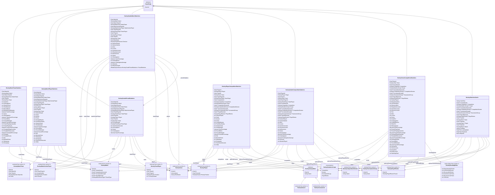

# Hockey domain — Statistics

```mermaid
classDiagram
    direction TB

    class BaseEntity {
        <<abstract>>
        +Guid Id
    }

    class HockeyCompetition {
        <<abstract>>
        +Guid Id
        +string Name
    }

    class HockeySeason {
        <<external from section 1>>
    }

    class HockeyTournament {
        <<external from section 1>>
    }

    class HockeyCompetitionDivision {
        <<external from section 1>>
        +Guid Id
        +string Name
    }

    class HockeyTournamentGroup {
        <<external from section 1>>
        +Guid Id
        +string Name
    }

    class HockeyPlayoffSeries {
        <<external from section 1>>
        +Guid Id
        +HockeyPlayoffRound Round
    }

    class HockeyStandingRules {
        <<value object from section 1>>
        +int RegulationWinPoints
        +int OvertimeWinPoints
        +int ShootoutWinPoints
        +int OvertimeLossPoints
        +int ShootoutLossPoints
        +int TiePoints
    }

    class HockeyMatch {
        <<external from section 3>>
        +Guid Id
        +Guid? CompetitionId
        +Guid? CompetitionDivisionId
        +Guid? TournamentGroupId
        +Guid? PlayoffSeriesId
        +HockeyMatchResultType? ResultType
    }

    class HockeyMatchTeam {
        <<external from section 3>>
        +Guid Id
        +Guid MatchId
        +Guid TeamId
        +HockeyTeamSlot TeamSlot
        +int Goals
    }

    class HockeyMatchActivePlayer {
        <<external from section 3>>
        +Guid Id
        +Guid TeamPlayerId
        +int JerseyNumber
        +HockeyPosition Position
        +bool IsGoalie
    }

    class HockeyTeam {
        <<external from section 2>>
        +Guid Id
        +string Name
        +string ShortName
    }

    class HockeyPlayer {
        <<external from section 2>>
        +Guid Id
        +Guid PersonId
        +HockeyPosition PrimaryPosition
    }

    class HockeyTeamPlayer {
        <<external from section 2>>
        +Guid Id
        +Guid TeamId
        +Guid PlayerId
        +HockeyPosition Position
        +int? JerseyNumber
    }

    class HockeyMatchTeamStatistics {
        +Guid MatchId
        +HockeyMatch Match
        +Guid MatchTeamId
        +HockeyMatchTeam MatchTeam
        +Guid TeamId
        +HockeyTeam Team

        +int GoalsFor
        +int GoalsAgainst
        +int ShotsOnGoal
        +int ShotAttempts
        +int MissedShots
        +int BlockedShotAttempts
        +decimal ShotPercentage

        +int Saves
        +int ShotsAgainst
        +decimal TeamSavePercentage

        +int FaceoffWins
        +int FaceoffAttempts
        +decimal FaceoffPercentage

        +int PowerPlayOpportunities
        +int PowerPlayGoals
        +decimal PowerPlayPercentage

        +int PenaltyKillOpportunities
        +int PenaltyKillSuccesses
        +decimal PenaltyKillPercentage

        +int Penalties
        +int PenaltyMinutes
        +int Hits
        +int BlockedShots
        +int Takeaways
        +int Giveaways
    }

    class HockeyMatchPlayerStatistics {
        +Guid MatchId
        +HockeyMatch Match
        +Guid MatchTeamId
        +HockeyMatchTeam MatchTeam
        +Guid MatchActivePlayerId
        +HockeyMatchActivePlayer MatchActivePlayer
        +Guid TeamPlayerId
        +HockeyTeamPlayer TeamPlayer
        +Guid PlayerId
        +HockeyPlayer Player
        +Guid TeamId
        +HockeyTeam Team

        +int GamesPlayed
        +int Goals
        +int Assists
        +int Points
        +int PenaltyMinutes
        +int PlusMinusRating
        +int ShotsOnGoal
        +int ShotAttempts
        +decimal ShotPercentage
        +int FaceoffWins
        +int FaceoffAttempts
        +decimal FaceoffPercentage
        +int Hits
        +int BlockedShots
        +int Takeaways
        +int Giveaways
        +int TimeOnIceSeconds
        +int Shifts
    }

    class HockeyGoaliePeriodStatistics {
        +Guid MatchId
        +HockeyMatch Match
        +Guid MatchTeamId
        +HockeyMatchTeam MatchTeam
        +Guid MatchActivePlayerId
        +HockeyMatchActivePlayer MatchActivePlayer
        +Guid TeamPlayerId
        +HockeyTeamPlayer TeamPlayer
        +Guid PlayerId
        +HockeyPlayer Player
        +Guid TeamId
        +HockeyTeam Team

        +int PeriodNumber
        +HockeyPeriodType PeriodType
        +int TimeOnIceSeconds
        +int ShotsAgainst
        +int Saves
        +int GoalsAgainst
        +decimal SavePercentage
    }

    class HockeyGoalieMatchStatistics {
        +Guid MatchId
        +HockeyMatch Match
        +Guid MatchTeamId
        +HockeyMatchTeam MatchTeam
        +Guid MatchActivePlayerId
        +HockeyMatchActivePlayer MatchActivePlayer
        +Guid TeamPlayerId
        +HockeyTeamPlayer TeamPlayer
        +Guid PlayerId
        +HockeyPlayer Player
        +Guid TeamId
        +HockeyTeam Team

        +bool WasStarter
        +HockeyGoalieDecision Decision
        +int GamesPlayed
        +int GamesStarted
        +int Wins
        +int Losses
        +int OvertimeLosses
        +int ShootoutLosses
        +int NoDecisions
        +int Saves
        +int ShotsAgainst
        +decimal SavePercentage
        +int GoalsAgainst
        +decimal GoalsAgainstAverage
        +int Shutouts
        +int MinutesPlayed

        +IReadOnlyCollection~HockeyGoaliePeriodStatistics~ PeriodStatistics
    }

    class HockeyStatisticsScope {
        <<enumeration>>
        Competition
        Division
        TournamentGroup
        PlayoffSeries
    }

    class HockeyPlayerCompetitionStatistics {
        +Guid PlayerId
        +HockeyPlayer Player
        +Guid TeamId
        +HockeyTeam Team
        +Guid TeamPlayerId
        +HockeyTeamPlayer TeamPlayer

        +Guid CompetitionId
        +HockeyCompetition Competition
        +HockeyStatisticsScope Scope

        +Guid? CompetitionDivisionId
        +HockeyCompetitionDivision? CompetitionDivision
        +Guid? TournamentGroupId
        +HockeyTournamentGroup? TournamentGroup
        +Guid? PlayoffSeriesId
        +HockeyPlayoffSeries? PlayoffSeries

        +int GamesPlayed
        +int Goals
        +int Assists
        +int Points
        +int PenaltyMinutes
        +int PlusMinusRating
        +int ShotsOnGoal
        +int ShotAttempts
        +decimal ShotPercentage
        +int FaceoffWins
        +int FaceoffAttempts
        +decimal FaceoffPercentage
        +int Hits
        +int BlockedShots
        +int Takeaways
        +int Giveaways
        +int TimeOnIceSeconds
        +int Shifts
    }

    class HockeyGoalieCompetitionStatistics {
        +Guid PlayerId
        +HockeyPlayer Player
        +Guid TeamId
        +HockeyTeam Team
        +Guid TeamPlayerId
        +HockeyTeamPlayer TeamPlayer

        +Guid CompetitionId
        +HockeyCompetition Competition
        +HockeyStatisticsScope Scope

        +Guid? CompetitionDivisionId
        +HockeyCompetitionDivision? CompetitionDivision
        +Guid? TournamentGroupId
        +HockeyTournamentGroup? TournamentGroup
        +Guid? PlayoffSeriesId
        +HockeyPlayoffSeries? PlayoffSeries

        +int GamesPlayed
        +int GamesStarted
        +int Wins
        +int Losses
        +int OvertimeLosses
        +int ShootoutLosses
        +int NoDecisions
        +int Saves
        +int ShotsAgainst
        +decimal SavePercentage
        +int GoalsAgainst
        +decimal GoalsAgainstAverage
        +int Shutouts
        +int MinutesPlayed
    }

    class HockeyTeamCompetitionStatistics {
        +Guid TeamId
        +HockeyTeam Team

        +Guid CompetitionId
        +HockeyCompetition Competition
        +HockeyStatisticsScope Scope

        +Guid? CompetitionDivisionId
        +HockeyCompetitionDivision? CompetitionDivision
        +Guid? TournamentGroupId
        +HockeyTournamentGroup? TournamentGroup
        +Guid? PlayoffSeriesId
        +HockeyPlayoffSeries? PlayoffSeries

        +int GamesPlayed
        +int RegulationWins
        +int OvertimeWins
        +int ShootoutWins
        +int RegulationLosses
        +int OvertimeLosses
        +int ShootoutLosses
        +int Ties
        +int Wins
        +int Losses
        +int Points
        +int GoalsFor
        +int GoalsAgainst
        +int GoalDifference
        +int ShotsFor
        +int ShotsAgainst
        +decimal ShotPercentage
        +int PowerPlayGoals
        +int PowerPlayOpportunities
        +decimal PowerPlayPercentage
        +int PenaltyKillOpportunities
        +int PenaltyKillSuccesses
        +decimal PenaltyKillPercentage
        +int PenaltyMinutes
        +int FaceoffWins
        +int FaceoffAttempts
        +decimal FaceoffPercentage
        +int HomeWins
        +int HomeLosses
        +int AwayWins
        +int AwayLosses
        +int StandingRank
    }

    class HockeyStatisticsCache {
        +string CacheKey
        +Guid? CompetitionId
        +HockeyCompetition? Competition
        +HockeyStatisticsScope? Scope

        +Guid? CompetitionDivisionId
        +HockeyCompetitionDivision? CompetitionDivision
        +Guid? TournamentGroupId
        +HockeyTournamentGroup? TournamentGroup
        +Guid? PlayoffSeriesId
        +HockeyPlayoffSeries? PlayoffSeries

        +Guid? TeamId
        +HockeyTeam? Team
        +Guid? PlayerId
        +HockeyPlayer? Player
        +Guid? MatchId
        +HockeyMatch? Match

        +string JsonData
        +DateTime LastUpdated
        +DateTime ExpiresAt
        +bool IsExpired
    }

    BaseEntity <|-- HockeyMatchTeamStatistics
    BaseEntity <|-- HockeyMatchPlayerStatistics
    BaseEntity <|-- HockeyGoaliePeriodStatistics
    BaseEntity <|-- HockeyGoalieMatchStatistics
    BaseEntity <|-- HockeyPlayerCompetitionStatistics
    BaseEntity <|-- HockeyGoalieCompetitionStatistics
    BaseEntity <|-- HockeyTeamCompetitionStatistics
    BaseEntity <|-- HockeyStatisticsCache

    HockeyCompetition <|-- HockeySeason
    HockeyCompetition <|-- HockeyTournament

    HockeyMatchTeamStatistics --> HockeyMatch : match
    HockeyMatchTeamStatistics --> HockeyMatchTeam : matchTeam
    HockeyMatchTeamStatistics --> HockeyTeam : team

    HockeyMatchPlayerStatistics --> HockeyMatch : match
    HockeyMatchPlayerStatistics --> HockeyMatchTeam : matchTeam
    HockeyMatchPlayerStatistics --> HockeyMatchActivePlayer : matchActivePlayer
    HockeyMatchPlayerStatistics --> HockeyTeamPlayer : teamPlayer
    HockeyMatchPlayerStatistics --> HockeyPlayer : player
    HockeyMatchPlayerStatistics --> HockeyTeam : team

    HockeyGoaliePeriodStatistics --> HockeyMatch : match
    HockeyGoaliePeriodStatistics --> HockeyMatchTeam : matchTeam
    HockeyGoaliePeriodStatistics --> HockeyMatchActivePlayer : matchActivePlayer
    HockeyGoaliePeriodStatistics --> HockeyTeamPlayer : teamPlayer
    HockeyGoaliePeriodStatistics --> HockeyPlayer : player
    HockeyGoaliePeriodStatistics --> HockeyTeam : team

    HockeyGoalieMatchStatistics --> HockeyMatch : match
    HockeyGoalieMatchStatistics --> HockeyMatchTeam : matchTeam
    HockeyGoalieMatchStatistics --> HockeyMatchActivePlayer : matchActivePlayer
    HockeyGoalieMatchStatistics --> HockeyTeamPlayer : teamPlayer
    HockeyGoalieMatchStatistics --> HockeyPlayer : player
    HockeyGoalieMatchStatistics --> HockeyTeam : team
    HockeyGoalieMatchStatistics "1" --> "*" HockeyGoaliePeriodStatistics : periodStatistics

    HockeyPlayerCompetitionStatistics --> HockeyPlayer : player
    HockeyPlayerCompetitionStatistics --> HockeyTeam : team
    HockeyPlayerCompetitionStatistics --> HockeyTeamPlayer : teamPlayer
    HockeyPlayerCompetitionStatistics --> HockeyCompetition : competition
    HockeyPlayerCompetitionStatistics --> HockeyStatisticsScope : scope
    HockeyPlayerCompetitionStatistics --> HockeyCompetitionDivision : optionalDivision
    HockeyPlayerCompetitionStatistics --> HockeyTournamentGroup : optionalTournamentGroup
    HockeyPlayerCompetitionStatistics --> HockeyPlayoffSeries : optionalPlayoffSeries

    HockeyGoalieCompetitionStatistics --> HockeyPlayer : player
    HockeyGoalieCompetitionStatistics --> HockeyTeam : team
    HockeyGoalieCompetitionStatistics --> HockeyTeamPlayer : teamPlayer
    HockeyGoalieCompetitionStatistics --> HockeyCompetition : competition
    HockeyGoalieCompetitionStatistics --> HockeyStatisticsScope : scope
    HockeyGoalieCompetitionStatistics --> HockeyCompetitionDivision : optionalDivision
    HockeyGoalieCompetitionStatistics --> HockeyTournamentGroup : optionalTournamentGroup
    HockeyGoalieCompetitionStatistics --> HockeyPlayoffSeries : optionalPlayoffSeries

    HockeyTeamCompetitionStatistics --> HockeyTeam : team
    HockeyTeamCompetitionStatistics --> HockeyCompetition : competition
    HockeyTeamCompetitionStatistics --> HockeyStatisticsScope : scope
    HockeyTeamCompetitionStatistics --> HockeyCompetitionDivision : optionalDivision
    HockeyTeamCompetitionStatistics --> HockeyTournamentGroup : optionalTournamentGroup
    HockeyTeamCompetitionStatistics --> HockeyPlayoffSeries : optionalPlayoffSeries
    HockeyTeamCompetitionStatistics --> HockeyStandingRules : standingRules

    HockeyStatisticsCache --> HockeyCompetition : competition
    HockeyStatisticsCache --> HockeyStatisticsScope : scope
    HockeyStatisticsCache --> HockeyCompetitionDivision : optionalDivision
    HockeyStatisticsCache --> HockeyTournamentGroup : optionalTournamentGroup
    HockeyStatisticsCache --> HockeyPlayoffSeries : optionalPlayoffSeries
    HockeyStatisticsCache --> HockeyTeam : team
    HockeyStatisticsCache --> HockeyPlayer : player
    HockeyStatisticsCache --> HockeyMatch : match
```
